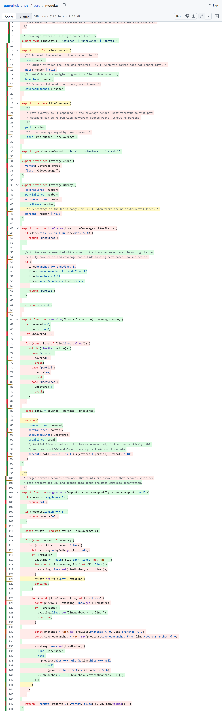
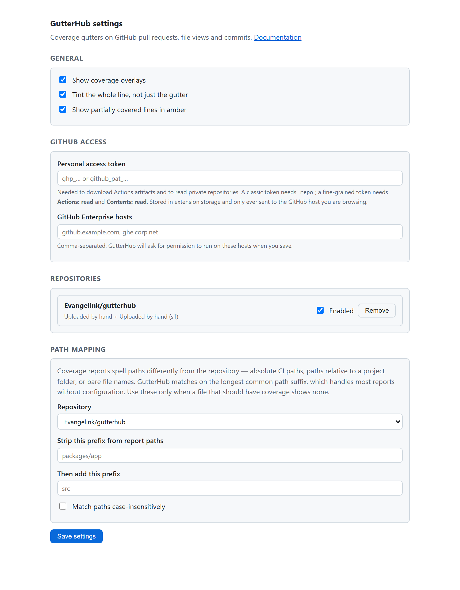

# GutterHub — Code Coverage for GitHub

Line-by-line test coverage, drawn straight onto GitHub.

GutterHub paints a green, amber or red bar next to every line of code on **pull request
diffs**, **file views** and **commits** — the same thing Azure DevOps shows natively for
pull request code coverage, and what GitLab shows in its diff view.

It is **vendor-neutral**: it reads plain coverage reports, so it works with whatever your
CI already produces. No account, no SaaS, no uploading your coverage anywhere.



## Status

Early. The core is tested and the extension builds for Chrome and Firefox, but it has not
been published to the extension stores yet — install it unpacked (below).

## Why this exists

| Option                                                                    | Vendor-neutral  | PR diffs                   | File views | Chrome   | Firefox |
| ------------------------------------------------------------------------- | --------------- | -------------------------- | ---------- | -------- | ------- |
| [Codecov extension](https://github.com/codecov/codecov-browser-extension) | ✗ needs Codecov | ✓                          | ✓          | ✓        | ✓       |
| [coverage-lens](https://github.com/ishay3000/coverage-lens)               | ✓               | ✓                          | ✗          | unpacked | ✓       |
| GitHub Code Quality                                                       | ✓               | file-level PR comment only | ✗          | n/a      | n/a     |
| **GutterHub**                                                             | ✓               | ✓                          | ✓          | ✓        | ✓       |

Coveralls, SonarQube Cloud, Codacy and Qlty ship no browser extension at all — their
line-level views live inside their own web UI.

## Supported reports

**Coverage** — green, amber or red per line. Branch data is used where the format
provides it, so a line that ran but never took one of its branches shows amber rather
than being passed off as covered.

| Format                                    | Produced by                                                                                 |
| ----------------------------------------- | ------------------------------------------------------------------------------------------- |
| **LCOV** (`lcov.info`)                    | `lcov`/`gcov`, Jest, Vitest, Karma, `cargo-llvm-cov`, Go via `gcov2lcov`, …                 |
| **Cobertura XML**                         | `coverlet`, `dotnet-coverage`, `pytest-cov`, JaCoCo (via converter), `gocover-cobertura`, … |
| **Istanbul JSON** (`coverage-final.json`) | `nyc`, Jest, Vitest                                                                         |

**Mutation testing** — the same three colours, meaning killed, partly killed and
survived. Amber is the interesting one here: a line where only some mutants were caught
is code that line coverage happily reports as fully covered.

| Format                               | Produced by                                                                     |
| ------------------------------------ | ------------------------------------------------------------------------------- |
| **`mutation-testing-elements` JSON** | Stryker (JS/TS), Stryker.NET (C#), Stryker4s (Scala), PIT (Java, via converter) |

The report kind is detected from the payload, so there is nothing extra to configure:
point GutterHub at a mutation report instead of a coverage one and the overlay relabels
itself.

### Both at once

You can load **two reports together**, and this is where it earns its keep. They draw as
two bars in the gutter, and any line the two disagree about is flagged with a dotted
underline and called out first in the tooltip:

```
⚠ Reports disagree — one rates this line good, another does not.
Code coverage: Covered by tests · 12 hits
Mutation testing: 0/2 mutants killed · survived: EqualityOperator
```

That is the finding neither report produces alone: a line coverage paints green whose
mutants all survived is code you believe is tested and is not. On this repository's own
source, overlaying its real coverage against a mutation report flags 58 such lines.

The worst of the two statuses drives the primary colour, so a line one report is happy
with and the other is not can never read as fine at a glance.

## Where the reports come from

Pick one per repository:

1. **GitHub Actions artifact** — GutterHub finds the workflow run for the commit you are
   looking at, downloads the matching artifact and reads the report out of it. Needs a
   token, because artifact downloads are authenticated even for public repositories.
2. **URL** — any reachable URL, built from a template:
   `https://ci.example.com/{owner}/{repo}/{sha}/lcov.info`.
   Placeholders: `{owner}` `{repo}` `{sha}` `{shortSha}` `{ref}` `{branch}` `{pr}` `{host}` `{path}`.
3. **Uploaded by hand** — paste or drop a report into the popup. Good for trying it out, for
   looking at coverage before you push, and for CI systems with nothing publicly reachable.

## Install

Not yet on the Chrome Web Store or AMO. To run it now:

```sh
git clone https://github.com/Evangelink/gutterhub
cd gutterhub
npm ci
npm run build
```

**Chrome / Edge** — go to `chrome://extensions`, turn on _Developer mode_, choose
_Load unpacked_, and select `dist/chrome`.

**Firefox** — go to `about:debugging#/runtime/this-firefox`, choose
_Load Temporary Add-on_, and select `dist/firefox/manifest.json`.

Then open a pull request, click the GutterHub icon and choose where your coverage lives.

## Path mapping

Coverage reports rarely spell paths the way GitHub does. A report may say
`/home/runner/work/repo/repo/src/app.ts`, `D:\a\1\s\src\App.cs`, `packages/app/src/main.ts`
or just `Adder.cs`, while GitHub only knows `src/app.ts`.

GutterHub matches on the **longest common path suffix** and requires one of the two paths
to be fully consumed, so `a/b/Foo.cs` never picks up coverage from `x/b/Foo.cs`. That
handles most reports with no configuration. When it does not, the options page offers a
prefix to strip, a prefix to add, and case-insensitive matching.



## Permissions

| Permission                 | Why                                                                                         |
| -------------------------- | ------------------------------------------------------------------------------------------- |
| `storage`                  | Remembers your settings and any report you upload by hand.                                  |
| `https://github.com/*`     | Draws the overlay.                                                                          |
| `https://api.github.com/*` | Resolves the pull request head commit and downloads artifacts.                              |
| optional `https://*/*`     | Only requested if you point GutterHub at your own coverage URL or a GitHub Enterprise host. |

Your token is kept in extension storage and is only ever sent to the GitHub host you are
browsing. Coverage reports are fetched by the extension and never leave your machine.

## Development

```sh
npm ci
npm run verify     # typecheck + tests + build
npm run watch      # rebuild on change
npm run test       # unit and DOM tests
npm run e2e        # load the built extension in Chromium against live GitHub
npm run package    # store-ready zips in artifacts/
```

`npm run e2e` is the check that matters most. It loads `dist/chrome` into a real browser,
seeds a report, opens a live GitHub page and asserts that the markers land where they
should. It is what caught the modern code view annotating every line twice. Point it at a
diff as well with `GUTTERHUB_E2E_PR=<pull request files url> npm run e2e`.

Icons are generated, not committed as opaque binaries: `node scripts/generate-icons.mjs`.

### Layout

```
src/core/        report parsing, path matching, and reports → renderable marks
src/providers/   where reports come from (Actions artifact, URL, manual)
src/github/      page detection, DOM adapters, the renderer
src/content/     orchestration: navigation, mutation handling, re-rendering
src/background/  fetching and caching, away from the page's CORS policy
src/ui/          popup and options
```

### Scope: two producers on one engine

Roughly three quarters of the code has no idea what it is drawing. The DOM adapters, page
detection, navigation handling, path matching and the fetch/cache layer only ever deal in
_"put a coloured mark and a tooltip on line N of file F"_. Coverage and mutation testing
are two producers of those marks:

```
coverage report ─┐
                 ├─ parse ─→ AnalysedFile ─→ LineMark[] ─→ renderer ─→ DOM
mutation report ─┘          └ kind-specific ┘  └──── knows nothing about either ────┘
```

`src/github/` imports `LineMark` as a **type only**, so it has no runtime dependency on
either domain model. Adding mutation testing needed a parser and a mark producer; the
renderer, the DOM adapters and the content script were untouched apart from generic
wiring — which is exactly what the end-to-end test now checks, on a live page, for both
kinds.

There is still deliberately **no plugin system**. Two producers is enough to know the
shape is right; it is not enough to justify a registry. A third would be one more file
alongside `src/core/mutation.ts`.

### On surviving GitHub's markup

The original Codecov extension was archived after years of chasing GitHub's HTML; its
last functional commit is literally _"fix gh compare bc new html classes"_. GutterHub
treats that as a design constraint rather than an accident:

- DOM knowledge is confined to `src/github/adapters/`, one adapter per rendering.
- Adapters are tried in order and the last one matches on `data-line-number` alone, so an
  unfamiliar layout still gets annotated. There is a test that feeds it markup no adapter
  was written for.
- Markers are drawn with inset box-shadows, never borders or extra cells, so nothing
  reflows and no table layout is disturbed.
- A file with no matching coverage is left completely untouched, because a half-painted
  diff reads as "this code is untested" rather than "no data".
- `node scripts/probe.mjs <github url>` dumps what a live page actually looks like —
  which selectors match, how many elements carry `data-line-number`, and whether any
  path attribute is present. Start there when the overlay stops appearing.

## Licence

[MIT](LICENSE)

Store listing copy lives in [`docs/store-listing.md`](docs/store-listing.md).
